# 🔒 Open-Source License Compliance Checker

[](https://www.python.org/downloads/)
[](https://flask.palletsprojects.com/)
[](https://www.docker.com/)
[](https://opensource.org/licenses/MIT)
[](http://makeapullrequest.com)

> **A powerful tool to analyze software dependencies and ensure compliance with open-source license policies.**

<div align="center">

**Built with ❤️ by AiExponent**

*Professional • Trustworthy • Modern*

</div>

---

## 📋 Table of Contents

- [Overview](#overview)
- [✨ Features](#-features)
- [🚀 Getting Started](#-getting-started)
- [🐳 Docker Deployment](#-docker-deployment)
- [🔧 How It Works](#-how-it-works)
- [⚠️ Limitations](#️-limitations)
- [🔮 Future Roadmap](#-future-roadmap)
- [🤝 Contributing](#-contributing)
- [📄 License](#-license)

## 🌟 Overview

The **Open-Source License Compliance Checker** is a comprehensive solution designed to help organizations maintain compliance with open-source license policies. This tool provides an intuitive way to analyze project dependencies and identify potential license conflicts before they become legal issues.

### 🎯 Who Should Use This Tool?

| Role | Use Case |
|------|----------|
| **👨‍💻 Developers** | Check license compatibility before committing code |
| **⚖️ Legal Teams** | Enforce company-wide open-source policies |
| **📊 Project Managers** | Get clear overview of licenses used in projects |
| **🔍 Compliance Officers** | Ensure adherence to organizational standards |

## ✨ Features

- **📁 Easy File Upload** - Drag & drop `requirements.txt` (Python) or `package.json` (Node.js) files
- **⚙️ Customizable Policies** - Define your own license policies with granular control
- **🎨 Color-Coded Reports** - Instant visual feedback on compliance status
- **🔍 Detailed Analysis** - Click any dependency for comprehensive license information
- **📊 Exportable Reports** - Download results as CSV for record-keeping
- **🚀 Fast Processing** - Quick analysis with real-time results

## 🚀 Getting Started

### Prerequisites

- Python 3.8 or higher
- pip package manager
- Modern web browser

### Local Installation

1. **Clone the repository**
   ```bash
   git clone https://github.com/your-username/license-compliance-checker.git
   cd license-compliance-checker
   ```

2. **Install dependencies**
   ```bash
   pip install -r requirements.txt
   ```

3. **Run the application**
   ```bash
   python app.py
   ```

4. **Access the tool**
   Open your browser and navigate to [http://127.0.0.1:5000](http://127.0.0.1:5000)

### 🐳 Docker Deployment

For streamlined deployment and consistent environments, use Docker:

```bash
# Build and run with Docker Compose
docker-compose up --build

# Or run directly with Docker
docker build -t license-checker .
docker run -p 5000:5000 license-checker
```

> **💡 Pro Tip**: Docker ensures consistent behavior across different environments and eliminates dependency conflicts.

## 🔧 How It Works

The tool follows a simple three-step process:

```mermaid
graph LR
    A[📁 Upload File] --> B[⚙️ Define Policy]
    B --> C[📊 Generate Report]
    C --> D[✅ Compliance Check]
```



### Step-by-Step Process

1. **📁 Upload Dependency File**
   - Drag & drop your `requirements.txt` or `package.json`
   - Support for multiple file formats
   - Automatic file validation

2. **⚙️ Define Your Policy**
   - Choose from predefined policies
   - Create custom license rules
   - Set risk thresholds

3. **📊 Get Detailed Report**
   - Instant compliance analysis
   - Color-coded results
   - Exportable findings

## ⚠️ Limitations

> **Current Version**: Proof of Concept (v0.1.0)

| Limitation | Description | Impact |
|------------|-------------|---------|
| **🔄 No Transitive Dependencies** | Only scans direct dependencies | May miss nested license issues |
| **🌍 Limited Ecosystem Support** | Python & Node.js only | Other languages not supported |
| **📝 Basic License Parsing** | Simple string matching | Complex licenses may be missed |
| **📦 Public Registry Only** | PyPI & npm support only | Private packages not supported |
| **🔢 No Version Analysis** | Latest version scanning only | Version-specific issues missed |

## 🔮 Future Roadmap

### 🎯 Phase 1: Core Enhancements
- [ ] **Comprehensive License Database** - Full SPDX license support
- [ ] **Dynamic Policy Management** - Save and manage custom policies
- [ ] **API Response Caching** - Performance optimization

### 🚀 Phase 2: Ecosystem Expansion
- [ ] **Multi-Language Support** - Java (Maven), Ruby (Gemfile), Go (go.mod)
- [ ] **Transitive Dependency Analysis** - Recursive license scanning
- [ ] **Advanced License Parsing** - SPDX expression support

### 🌟 Phase 3: Enterprise Features
- [ ] **Team Collaboration** - Shared policies and reports
- [ ] **Integration APIs** - CI/CD pipeline support
- [ ] **Advanced Analytics** - Compliance trends and insights

## 🤝 Contributing

We welcome contributions from the community! Here's how you can help:

### 🐛 Report Issues
- Use the [GitHub Issues](https://github.com/your-username/license-compliance-checker/issues) page
- Provide detailed reproduction steps
- Include system information and error logs

### 💡 Suggest Features
- Open a feature request issue
- Describe the use case and benefits
- Consider implementation complexity

### 🔧 Submit Pull Requests
1. Fork the repository
2. Create a feature branch (`git checkout -b feature/amazing-feature`)
3. Commit your changes (`git commit -m 'Add amazing feature'`)
4. Push to the branch (`git push origin feature/amazing-feature`)
5. Open a Pull Request

### 📋 Development Guidelines
- Follow PEP 8 for Python code
- Add tests for new functionality
- Update documentation as needed
- Ensure all tests pass before submitting

## 📄 License

This project is licensed under the **MIT License** - see the [LICENSE](LICENSE) file for details.

```
MIT License

Copyright (c) 2024 AiExponent - License Compliance Checker

Permission is hereby granted, free of charge, to any person obtaining a copy
of this software and associated documentation files (the "Software"), to deal
in the Software without restriction, including without limitation the rights
to use, copy, modify, merge, publish, distribute, sublicense, and/or sell
copies of the Software, and to permit persons to whom the Software is
furnished to do so, subject to the following conditions:

The above copyright notice and this permission notice shall be included in all
copies or substantial portions of the Software.

THE SOFTWARE IS PROVIDED "AS IS", WITHOUT WARRANTY OF ANY KIND, EXPRESS OR
IMPLIED, INCLUDING BUT NOT LIMITED TO THE WARRANTIES OF MERCHANTABILITY,
FITNESS FOR A PARTICULAR PURPOSE AND NONINFRINGEMENT. IN NO EVENT SHALL THE
AUTHORS OR COPYRIGHT HOLDERS BE LIABLE FOR ANY CLAIM, DAMAGES OR OTHER
LIABILITY, WHETHER IN AN ACTION OF CONTRACT, TORT OR OTHERWISE, ARISING FROM,
OUT OF OR IN CONNECTION WITH THE SOFTWARE OR THE USE OR OTHER DEALINGS IN THE
SOFTWARE.
```

---

<div align="center">

**Made with ❤️ by AiExponent**

*Professional • Trustworthy • Modern*

[](https://github.com/your-username/license-compliance-checker)
[](https://github.com/your-username/license-compliance-checker)
[](https://github.com/your-username/license-compliance-checker)

</div>